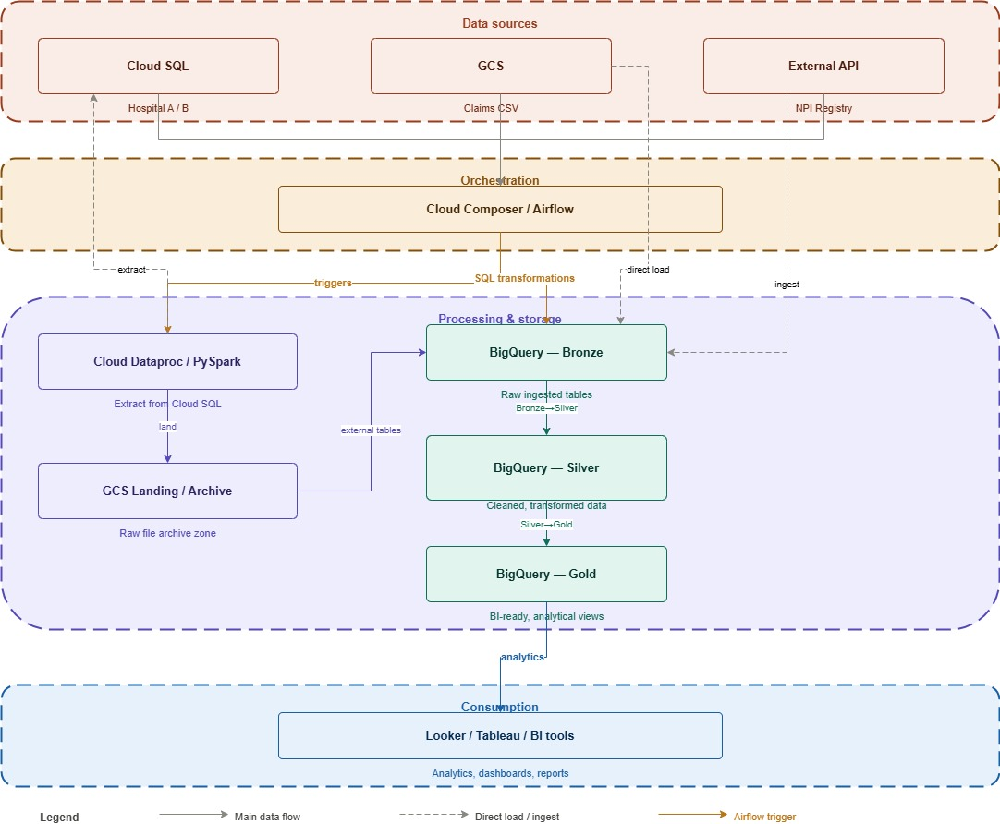
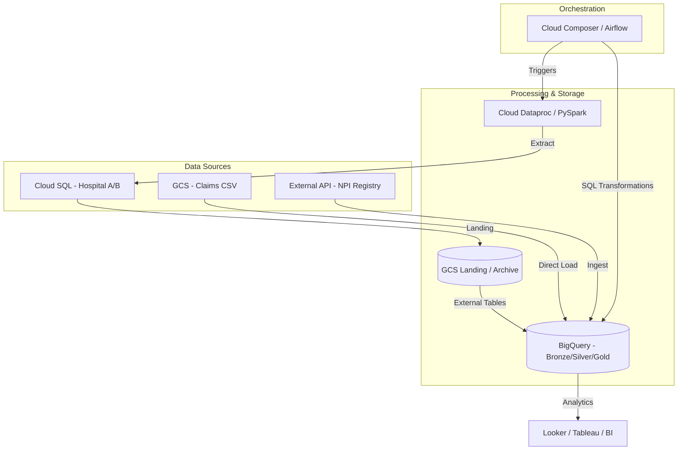

# dcn-gcp-healthcare-pipeline

An end-to-end GCP Data Engineering pipeline designed for the Healthcare domain. This project implements a Medallion architecture (Bronze, Silver, Gold) to ingest, transform, and analyze healthcare data from disparate sources including MySQL databases, CSV files, and external APIs.

##  Business Context

In the modern healthcare landscape, data is often siloed across different hospital branches, legacy databases, and third-party APIs. This project addresses the need for a unified data platform to solve:
*   **Data Fragmentation**: Consolidating patient, provider, and department information from multiple hospital systems (Hospital A & B).
*   **Historical Tracking**: Ensuring clinical and demographic changes are preserved for auditing and longitudinal studies.
*   **Revenue Cycle Management (RCM)**: Integrating claims data with clinical encounters to analyze financial health and provider performance.

## 🏗️ Project Architecture




The pipeline follows a modern data engineering workflow on Google Cloud Platform:

1.  **Data Sources**:
    *   **Cloud SQL (MySQL)**: Transactional data from multiple hospital systems (Hospital A, Hospital B).
    *   **GCS Landing**: Raw CSV files for claims and metadata.
    *   **External API**: NPI (National Provider Identifier) registry data fetched via Python.
2.  **Ingestion & Processing**:
    *   **Cloud Composer (Airflow)**: Orchestrates the entire workflow.
    *   **Cloud Dataproc**: Executes PySpark jobs to extract data from MySQL via JDBC, perform initial cleansing, and handle watermarking.
3.  **Storage & Warehouse (BigQuery)**:
    *   **Landing (GCS)**: Raw JSON/Parquet files stored in Cloud Storage.
    *   **Bronze**: Raw data mirrored in BigQuery tables.
    *   **Silver**: Cleaned and standardized data with deduplication and unified schemas.
    *   **Gold**: Aggregated business-ready tables for analytics (e.g., Provider Performance, Financial Metrics).

## 🚀 Tech Stack

*   **Orchestration**: Google Cloud Composer (Apache Airflow)
*   **Compute**: Google Cloud Dataproc (Spark/PySpark)
*   **Storage**: Google Cloud Storage (GCS)
*   **Warehouse**: Google BigQuery
*   **Database**: Google Cloud SQL (MySQL)
*   **Languages**: Python, PySpark, SQL

## 📂 Project Structure

```text
├── data/
│   ├── BQ/                     # SQL scripts for Bronze, Silver, and Gold transformations
│   └── INGESTION/              # PySpark scripts for data extraction and landing
├── utils/
│   ├── add_dags_to_composer.py # Helper script to sync local files to Composer bucket
│   └── requirements.txt        # Python dependencies
└── workflows/
    ├── pyspark_dag.py          # Airflow DAG for Dataproc cluster and ingestion jobs
    └── bq_dag.py               # Airflow DAG for BigQuery SQL transformations
```

## ⚙️ Pipeline Details

### 🔑 Key Techniques
*   **Incremental Ingestion (Watermarking)**: PySpark scripts utilize a high-watermarking strategy, querying BigQuery audit logs to fetch only new records from MySQL, reducing I/O and cost.
*   **SCD Type 2 (Slowly Changing Dimensions)**: Implemented in the Silver layer using BigQuery `MERGE` statements. This ensures a full history of patient and transaction changes is maintained with `is_current` and `effective_date` flags.
*   **Data Quality & Quarantine**: Records failing critical validation (e.g., missing Patient IDs or malformed dates) are flagged as `is_quarantined` rather than dropped, allowing for downstream data stewardship.
*   **Automated Observability**: Every ingestion run logs status, record counts, and timestamps to a centralized BigQuery audit table and GCS JSON logs.
*   **Medallion Storage**: Progressive data refinement from Raw (Bronze) to Standardized (Silver) to Analytic (Gold).

### 1. Ingestion Workflow (`pyspark_dag`)
*   **Cluster Management**: Dynamically starts a Dataproc cluster and stops it upon completion to optimize costs.
*   **Hospital Ingestion**: Incremental and full loads from MySQL to GCS Landing using watermarking tracked in BigQuery.
*   **Claims & NPI**: Ingests claims from GCS and fetches California-based provider data from the NPI Registry API.

### 2. Transformation Workflow (`bigquery_dag`)
*   **Bronze Layer**: Loads raw data from GCS.
*   **Silver Layer**: Standardizes Patient IDs, handles data types, and implements "Quarantine" flags for data quality.
*   **Gold Layer**: Generates high-value analytics tables including:
    *   `patient_history`: Unified view of patient visits and financial interactions.
    *   `provider_performance`: Analysis of claim approval rates and billed amounts.
    *   `department_performance`: Efficiency and revenue metrics by department.

## 🛠️ Setup & Deployment

### Prerequisites
*   GCP Project with billing enabled.
*   APIs enabled: Dataproc, BigQuery, Cloud SQL, Cloud Composer.
*   `gcloud` CLI configured.

### Deployment
1.  **Configure Environment**:
    Update the `COMPOSER_BUCKET` and `PROJECT_ID` variables in `workflows/pyspark_dag.py` and `workflows/bq_dag.py`.

2.  **Upload Code to Composer**:
    Use the utility script to upload DAGs and PySpark scripts to your Composer environment:
    ```bash
    python utils/add_dags_to_composer.py --dags_directory ./workflows --dags_bucket <YOUR_BUCKET> --data_directory ./data
    ```

3.  **Configure MySQL**:
    Ensure your Cloud SQL instances allow connections from the Dataproc cluster and that credentials match those in the ingestion scripts.

## 📊 Analytics & Reporting

The Gold layer tables are designed for direct consumption by BI tools like Looker or Tableau.
*   **Financial Health**: Outstanding balance calculations and claim success rates.
*   **Operational Efficiency**: Total encounters and average payments per transaction.

---
*Maintained by Saurabh Sinha*
